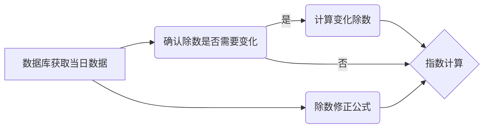

# 集合竞价时期指数计算

该脚本用于计算特定日期范围内的 CSI 指数相关指标(仅展示两日的计算结果)，主要通过处理交易数据和开盘 / 收盘数据，生成基于时间粒度的指数市值数据，并将结果保存为 Feather 格式文件，便于后续分析和处理。


## 计算方法
在集合竞价阶段指数的计算中，根据指数计算公式：

$$\mathrm{基点} \times \frac{\sum_{i} \left( \mathrm{样本价格}_{i,t} \times \mathrm{调整股本数}_{i,t} \times \mathrm{权重因子}_{i,t} \times \mathrm{汇率}_{i,t} \right)}{\mathrm{除数}_{t}} = \mathrm{指数点位}_{t}$$

可知，在已知基点，样本价格，调整股本数，权重因子和汇率的情况下，重点是确定除数的值，除数的变化分为以下三种情况：

 **1. 样本公司发生可能影响证券价格变动的公司事件时**

当样本现金分红时，价格指数除数不予修正，任其自然回落。全收益指数、净收益指数在样本除息日前一交易日收盘后修正指数除数。当样本送股、配股、拆股或缩股时，价格指数、全收益指数、净收益指数在样本除权日前一交易日收盘后修正指数除数。

 **2. 样本公司发生引起股本变动的其他公司事件时**

当样本股本发生由其他公司事件（如增发、债转股、权证行权等）引起的总股本变动累计达到或超过 5%时，对其进行临时调整，在样本的股本变动生效日前一交易日收盘后修正指数除数。当样本股本发生由其他公司事件引起的总股本变动累计不及 5%时，每半年定期调整一次，调整生效时间分别为每年 6 月和 12 月的第二个星期五的下一交易日，在股本定期调整生效日前一交易日收盘后修正指数除数。

**3. 样本调整**

当指数样本定期调整或临时调整生效时，在调整生效日前一交易日收盘后修正指数除数。

由于这样的计算过于繁琐，对于每年240 - 250 个交易日，每个交易日五万余条数据而言计算量过大，我们希望用更简便的方法求得除数，从而引出**除数修正公式**
已知指数计算公式可简化为：

$$\mathrm{基点} \times \frac{\mathrm{指数调整市值}_{t}}{\mathrm{除数}_{t}} = \mathrm{指数点位}_{t}$$
由于**除数**每日会发生变化且变化仅与**指数调整市值**有关，且指数具有**连续性**，考虑将当日的股本成分带入上一天的价格得到对应的除数
除数修正公式：

$$\mathrm{除数}_{t} = \mathrm{基点} \times \frac{\mathrm{指数修正后调整市值}_{t-1}}{\mathrm{指数调整市值}_{t-1}} \times \mathrm{除数}_{t-1}$$

其中，

$$\mathrm{指数修正后调整市值}_{t-1} = \sum_{i} \left( \mathrm{调整后的样本价格}_{i,t-1} \times \mathrm{调整股本数}_{i,t} \times \mathrm{权重因子}_{i,t} \times \mathrm{汇率}_{i,t-1} \right)$$

这种计算方法大大降低了计算成本，经测试，一年的交易数据仅需**一分钟**即可计算完成完整的逻辑流程图如图所示：


## 核心功能

-   读取 CSI 指数成分股数据（`csi500.2023120405.feather`）
-   处理指定月份的交易数据（`mytrade.2023120405.feather`）和开盘 / 收盘数据（`myopcls.2023120405.feather`）
-   按日期分组计算每个时间点的指数市值
-   生成包含日期、时间和对应市值的结果文件（`mvcsi.2023120405.feather`）

## 依赖环境

-   Python 3.x
-   pandas
-   feather-format
-   pyarrow（Feather 文件处理依赖）


## 使用方法

1.  准备好以下数据文件并放置在指定路径：
    
    -   CSI 指数成分股数据：`csi500.2023120405.feather`
    -   交易数据：`mytrade.2023120405.feather`
    -   开盘 / 收盘数据：`myopcls.2023120405.feather`
2.  运行脚本：

```python
python calculate.csi.py
```
3.  结果文件将生成在：`mvcsi.2023120405.feather`


## 输出说明

生成的 Feather 文件包含以下字段：

  

-   `tdate`：日期
-   `ttime`：时间
-   `mvalue`：计算得到的指数市值


