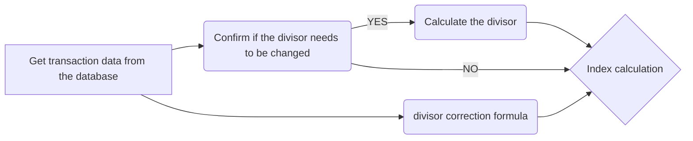

# Index calculation during call auction period
This script is used to calculate CSI index-related indicators within a specific date range (displaying only two days of calculation results), mainly by processing trading data and opening/closing data, generating index market value data based on time granularity, and saving the results as Feather format files for subsequent analysis and processing.

## Calculation method
In the calculation of the index during the call auction stage, according to the index calculation formula:
$$\mathrm{Base Value} \times \frac{\sum_{i} \left( \mathrm{Constituent  Price}_{i,t} \times \mathrm{Adjusted  Shares}_{i,t} \times \mathrm{Weight  Factor}_{i,t} \times \mathrm{Exchange  Rate}_{i,t} \right)}{\mathrm{Divisor}_{t}} = \mathrm{Index}_{t}$$

It can be seen that, given the base value, constituent  price, adjusted shares, weight factors, and exchange rate, the key is to determine the value of the divisor, and the change in the divisor can be divided into the following three situations:

 **1. Corporate Events that may Affect the Price of Constituents**
When any constituent goes ex-dividend, the divisor of the price index is not adjusted, and the price index’s natural fall shall not be interfered with. The divisors of the total return index and net return index shall be adjusted after the closing of the trading day before the ex-dividend day. When any constituent goes through a stock dividend, rights issue, stock split, or stock consolidation, the divisors of the price index, total return index, and net return index shall be adjusted after the closing of the trading day before the ex-right day.

 **2. Other Corporate Events that Affect the Number of Shares of Constituents**
In the situation that the accumulated change in the total number of shares of constituents due to other corporate events (e.g., secondary offering, debt-to-equity swap, and exercise of warrants) reaches or exceeds 5%, the index divisor is subject to temporary adjustment and shall be
adjusted after the close of the trading day before the effective date of the change in the number of
shares of the index constituents.
Where the accumulated change in the total number of shares of constituents due to other corporate events is less than 5%, it is adjusted periodically semi-annually. The adjustment takes effect on the trading day of the second Friday of June and December each year, and the index divisor shall be adjusted after the close of the trading day before the effective date of the periodical adjustment.

**3. Constituents adjustment**
When there is a periodical or temporary adjustment in the index constituents, the index divisor shall be adjusted after the close of the trading day before the effective date of the periodical adjustment.

Due to the complexity of this calculation, it is too much for 240-250 trading days per year, with over 50000 pieces of data per trading day. We hope to use a simpler method to obtain the divisor and introduce the **divisor correction formula**. The formula for calculating known indices can be simplified as:

$$\mathrm{Base Value} \times \frac{\mathrm{Index adjusted Market Cap}_{t}}{\mathrm{Divisor}_{t}} = \mathrm{Index}_{t}$$

Given that the **divisor changes daily** and is solely tied to the **index-adjusted market cap**, and considering the **continuity** of the index, we can derive the corresponding divisor by rolling over the equity components of the current day to the prices of the previous day.
Divisor Adjustment Formula:

$$\mathrm{Divisor}_{t} = \mathrm{Base Value} \times \frac{\mathrm{Index Adjusted Market Cap After Adjustment}_{t-1}}{\mathrm{Index Adjusted Market Cap}_{t-1}} \times \mathrm{Divisor}_{t-1}$$

And

$$\mathrm{Index Adjusted Market Cap After Adjustment}_{t-1} = \sum_{i} \left( \mathrm{Adjusted Constituent Price}_{i,t-1} \times \mathrm{Adjusted Shares}_{i,t} \times \mathrm{Weight Factor}_{i,t} \times \mathrm{Exchange Rate}_{i,t-1} \right)$$

This calculation method greatly reduces the computational cost. After testing, it only takes **one minute** to complete the complete logical flowchart of one month's transaction data, as shown in the figure:


## Function
-   Read CSI index constituent stock data (`csi500.2023120405.feather`)
-   Process transaction data for a specified month (`mytrade.2023120405.feather`) and opening/closing data (`myopcls.2023120405.feather`)
-   Calculate the index at each time point by grouping by date
-   Generate a result file containing date, time, and corresponding index (`mvcsi.2023120405.feather`)

## Environment
-   Python 3.x
-   pandas
-   feather-format
-   pyarrow (Feather)

## Usage
1.  Prepare the following data files and place them in the specified path:
    -   CSI index constituent stock data: `csi500.2023120405.feather`
    -   transaction data: `mytrade.2023120405.feather`
    -   opening/closing data: `myopcls.2023120405.feather`
2.  Run the script:
```python
python calculate.csi.py
```
3.  The result file will be generated in: `mvcsi.2023120405.feather`

## Output
The generated Feather file contains the following fields:
-   `tdate`: date
-   `ttime`: time
-   `mvalue`: index
